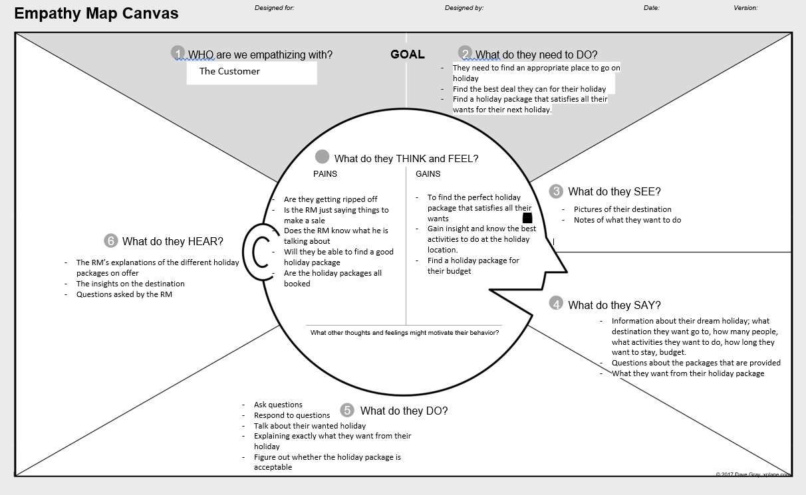
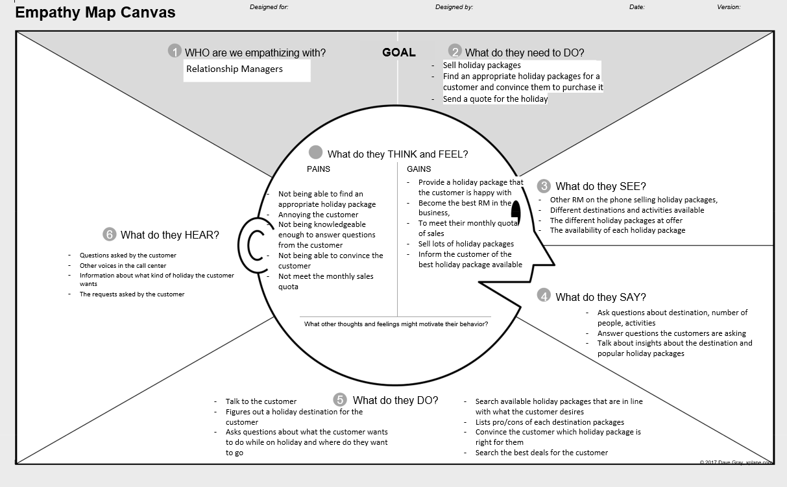

#### Students Contributing to this report
1. Nathan
2. Ayush 
3. Nafisul 
4.Jianmu Huang
### Assumptions

- We will have to assume what the criteria is for likelihood on a person buying the product. (e.g. purchase history) 
- Is the profiler tool an assumption? 
- Employees answer their questionnaire truthfully 

### Define the problem: 

##### User 

People who are interested on travelling and want to use ‘major travel company’. 

##### Need 

To find out about the different holiday packages on offer for their destination 

##### Insight 

It is hard to know where to go and what to do in destinations you have not been before. 

### Stakeholders

- Relationship Managers 
- Customers 
- Developers of the system 

### Objectives of the system

- The system will adjust the call flow rate to suitable Relationship Managers (RM) 
- To provide improved call routing and dynamic call flow control for both inbound and outbound calls 
- To improve the call flow rate is to match customers based on RM performance and product knowledge 
- Matching end-customers to well informed RMs with appropriate knowledge about the destination and its traditions 
- Be able to use the customer profiles created from the Profiler Tool ( looks at age, sex, culture, language proficiency, experience and product knowledge) to match users with appropriate RM, to improve sales. 
- The system will adjust the RMs profile according to subsequent performance in selling packages and in serving customers effectively and efficiently. 
- With outbound calls, the system dials numbers automatically according to a customer target list generated by the system 
- The system retrieves customers details from a database. It then displays the details and provides the RM with guidelines and a script to help in providing an improved service 
- The system will create a target list for each RM based on their skills and profile. A target list is a list of tuples in the format <potential customer, product proposed> 
- A skill score is calculated based on the RM’s previous call duration and profile. (do they mean customer here?) 
- A score from 1-10 based on the likelihood to purchase the product is given to a customer according to some preloaded criteria 
- During busy times, inbound customers can be directed to an Interactive Voice Response (IVP)
- The IVP will prompt users for options, and may even ask for call reasons in a few words and then redirect the call to an Automatic Call Distributor routing the call to the first available appropriate RM.

### Empathy Maps

