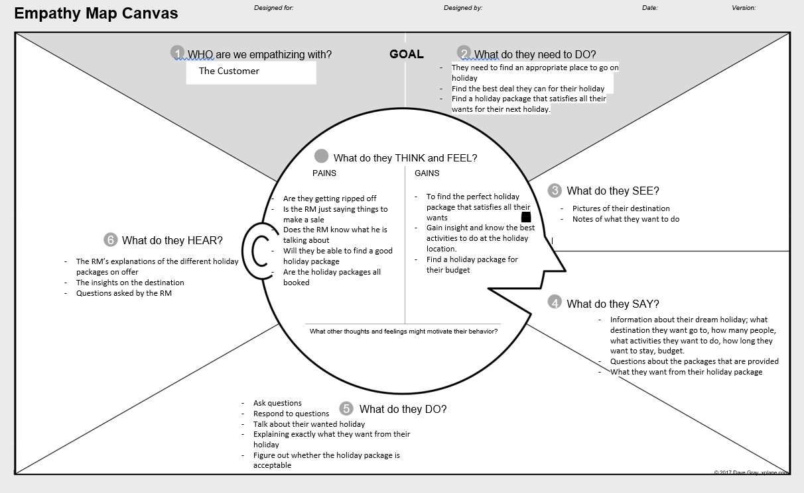
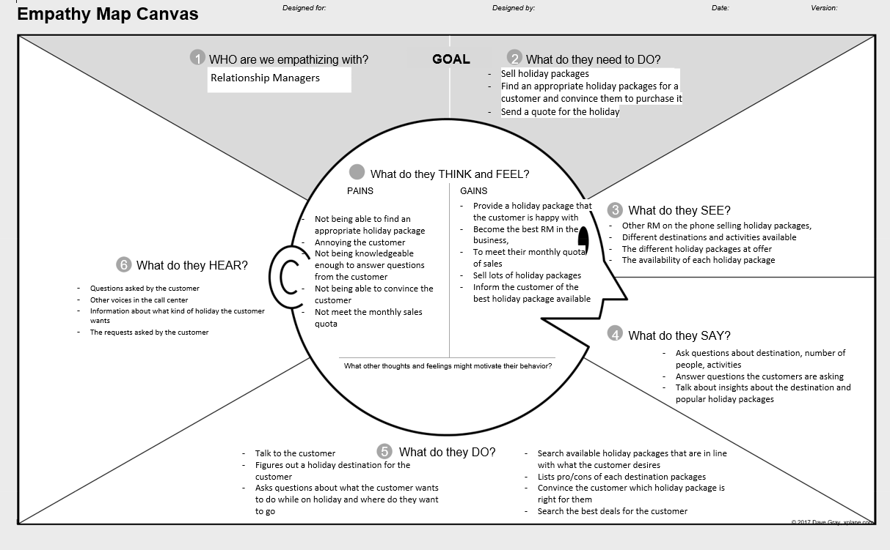
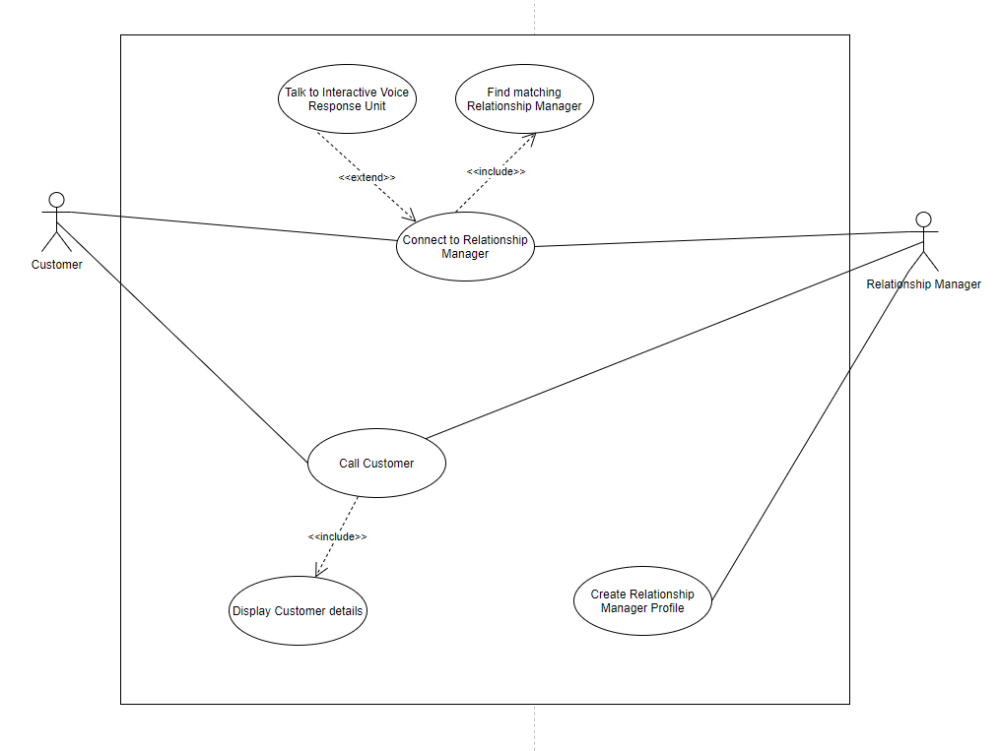
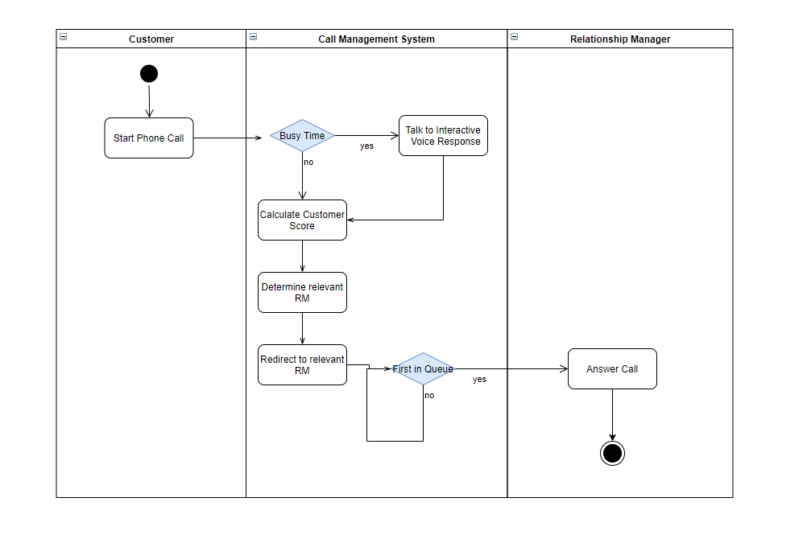
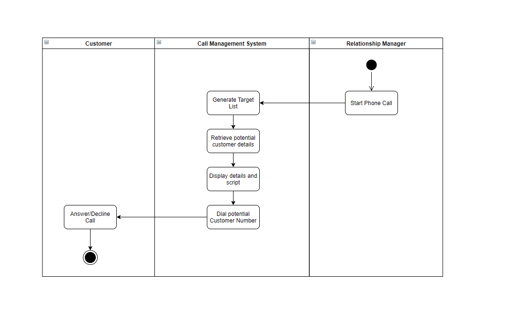
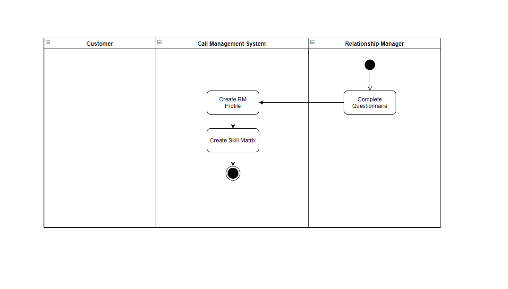

#### Students Contributing to this report
1. Nathan
2. Ayush 
3. Nafisul
4.Jianmu Huang
### Assumptions

- We will have to assume what the criteria is for likelihood on a person buying the product. (e.g. purchase history) 
- Is the profiler tool an assumption? 
- Employees answer their questionnaire truthfully 

### Define the problem: 

##### User 

People who are interested in travelling and want to use ‘major travel company’. 

##### Need 

To find out about the different holiday packages on offer for their destination 

##### Insight 

It is hard to know where to go and what to do in destinations you have not been before. 

### Stakeholders

- Relationship Managers 
- Customers 
- Developers of the system 

### Objectives of the system

- The system will adjust the call flow rate to suitable Relationship Managers (RM) 
- To provide improved call routing and dynamic call flow control for both inbound and outbound calls 
- To improve the call flow rate is to match customers based on RM performance and product knowledge 
- Matching end-customers to well informed RMs with appropriate knowledge about the destination and its traditions 
- Be able to use the customer profiles created from the Profiler Tool ( looks at age, sex, culture, language proficiency, experience and product knowledge) to match users with appropriate RM, to improve sales. 
- The system will adjust the RMs profile according to subsequent performance in selling packages and in serving customers effectively and efficiently. 
- With outbound calls, the system dials numbers automatically according to a customer target list generated by the system 
- The system retrieves customers details from a database. It then displays the details and provides the RM with guidelines and a script to help in providing an improved service 
- The system will create a target list for each RM based on their skills and profile. A target list is a list of tuples in the format <potential customer, product proposed> 
- A skill score is calculated based on the RM’s previous call duration and profile. (do they mean customer here?) 
- A score from 1-10 based on the likelihood to purchase the product is given to a customer according to some preloaded criteria 
- During busy times, inbound customers can be directed to an Interactive Voice Response (IVP)
- The IVP will prompt users for options, and may even ask for call reasons in a few words and then redirect the call to an Automatic Call Distributor routing the call to the first available appropriate RM.

### Empathy Maps

### Point of View Statements

User | Need | Insight
------------ | ------------- | -------------
People who are interested in travelling and want to use ‘major travel company’. | To find out about the different holiday packages on offer for their destination | It is hard to know where to go and what to do in destinations you have not been before
People who are interested in travelling and want to use ‘major travel company’  | To understand what the culture and traditions of their destination | It important that the customer understands the culture in order to decide whether it is a suitable place for them to go on holiday
People who are interested in travelling and want to use ‘major travel company’  | To start talking with a relationship manager within a timely period | Customers often hang up if they suffer from a long wait time
Relationship managers working in ‘major travel company’  | To sell holiday packages to customers | It is difficult to find the best holiday package because there is such a wide variety of holiday packages at offered by the travel company
Relationship managers working in ‘major travel company’  | To receive calls about destinations where they have relevant knowledge | They are receiving calls about destination they are not knowledgeable in. Having relevant knowledge about the destination will improve the likelihood of a sale.

### How Might We Statements 

From the POV statements we were able to extract the following ‘How Might We’ (HMW) statements: 

- How might we help customers understand the different holiday packages on offer? 
- How might we make customers understand the culture of their destination? 
- How might we decrease the amount of time a customer is waiting to speak to a RM? 
- How might we improve the amount of holiday packages sold per RM? 
- How might we make it easier for RM to select the best holiday package? 
- How might we make sure that a customer is speaking to a RM with the relevant knowledge for their destination?

### Reflection

Seeing as the aim of the system is to improve the operation of the CMC there will be limited input by users. There will be heavy emphasis on automation, increasing the flow rate of calls to improve the rate of sale.It was brainstormed that a typical workflow would look like the following.

##### For inbound calls:

The customer would call ‘major travel company’, they would be assigned a score between 1-10. The system will look at the caller’s profile and determine which RM is most suitable for the customer and puts them in a waiting queue for this RM. During times of high traffic times, customers will be prompted by an Interactive Voice Response unit which will ask questions to further narrow down which RM they should talk to. They are redirected to the Automatic Call Distributor (ACD) which will then route them to the next relevant RM available. 

##### For Outbound calls:

The system will automatically dial a number to an end-customer based on the RM’s target list. The system will get the details of the end-customer from its database and display it to the RM. Additionally the system will provide a script and guidelines to help the RM provide an enhanced service to the end-customer. 

It is important to note that a target list is created by looking at the end-customer's profile, the system will determine some holiday packages it believes the user will be interested in buying. Following this it searches through all the RMs in the company to determine which one of them is most relevant to sell the proposed product. Finally, the target list is compiled into the format <potential customer, product proposed> and is appointed to the relevant RM. 

##### New assumptions found

Through our brainstorming the following assumptions were found:
- All current Relationship Managers have already completed the questionnaire.  
- Relationship Managers will have access to a computer which is connected to the system as well as the internet. 

### Backlog

ID | As a... | I want to be able to... | So that... | Priority
------------ | ------------- | ------------- | ------------- | -------------
1 | End-Customer | Talk to a relationship manager in the quickest amount of time | I can start discussing which holiday package I can chose | M
2 | End-Customer | Assigned a customer score when I call ‘major travel company’ | I can be put through to a RM and served in an appropriate amount of time  | M
3 | End-Customer | Have my customer score updated after my call | The next time my call will be processed quicker | L
4 | End-Customer | Be directed to an Iterative Voice Response unit during times of high traffic | I can be routed to the next available RM that is relevant to me | M
5 | Relationship Manager | Always have the relevant knowledge about the customer’s destination  | I can improve my chance at a sale  | M
6 | Relationship Manager | Be matched with customers according to my skills and the customer’s profile | I can provide better service and increase the likelihood of a sale | H
7 | Relationship Manager | Have a customer target list | I can have a list of customers that I can call | H
8 | Relationship Manager | See the customer’s details when performing an outbound call | I know which products I should propose to the customer | M
9 | Relationship Manager | See a script of what I should be saying to the customer when performing an outbound call | I can provide an improved service to the customer | H
10 | Relationship Manager | Complete an initial skills questionnaire | I can be initialized a RM Profile | H
11 | Relationship Manager | Be assigned a skill score | I can be given appropriate calls according to my skill | M
12 | Relationship Manager | Have an estimated call duration | I know how long I am supposed to take to help the customer | M
13 | Relationship Manager | Have my skill score updated after my call | My skill score better represents my efficiency as a RM | M
14 | Relationship Manager | See a list of popular holiday packages according to my destination | It is easier for me to select the best holiday package for the customer | L

### Use Cases

- When a customer calls the ‘major travel company’ and needs to be redirected the appropriate RM. This is broken down into finding the correct RM as well as transferring to the Interactive Voice Response unit if necessary. 
- When a RM uses the system to make an outbound call. This is broken down into getting customer details and displaying them. 
- When a new RM wants to create their RM Profile

### Use Case Diagram

### Activity Diagrams

##### Inbound Calls

##### Outbound Calls

##### Creating Relationship Manager Profile

