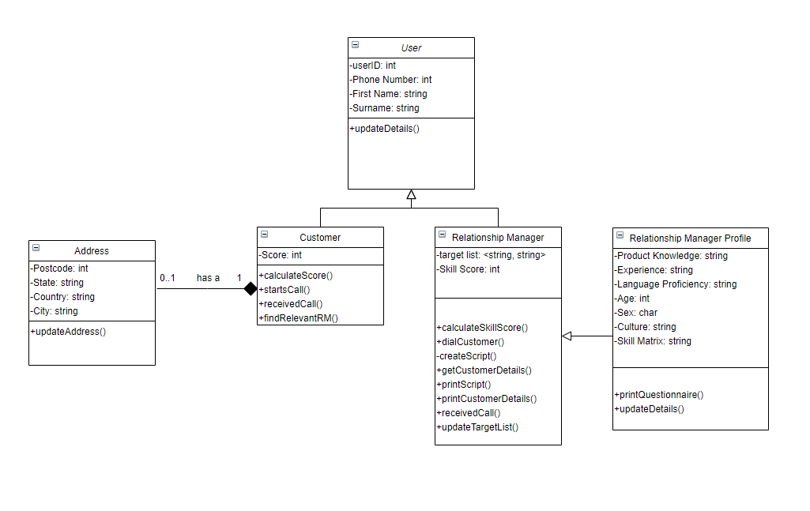

#### Students Contributing to this report
1. Nathan
2. Ayush 
3. Nafisul
4.Jianmu Huang
=======

-------------
# Objectives of the system

- The system will adjust the call flow rate to suitable Relationship Managers (RM) 
- To provide improved call routing and dynamic call flow control for both inbound and outbound calls 
- To improve the call flow rate is to match customers based on RM performance and product knowledge 
- Matching end-customers to well informed RMs with appropriate knowledge about the destination and its traditions 
- Be able to use the customer profiles created from the Profiler Tool ( looks at age, sex, culture, language proficiency, experience and product knowledge) to match users with appropriate RM, to improve sales. 
- The system will adjust the RMs profile according to subsequent performance in selling packages and in serving customers effectively and efficiently. 
- With outbound calls, the system dials numbers automatically according to a customer target list generated by the system 
- The system retrieves customers details from a database. It then displays the details and provides the RM with guidelines and a script to help in providing an improved service 
- The system will create a target list for each RM based on their skills and profile. A target list is a list of tuples in the format <potential customer, product proposed> 
- A skill score is calculated based on the RM’s previous call duration and profile.
- A score from 1-10 based on the likelihood to purchase the product is given to a customer according to some preloaded criteria 
- During busy times, inbound customers can be directed to an Interactive Voice Response (IVP)
- The IVP will prompt users for options, and may even ask for call reasons in a few words and then redirect the call to an Automatic Call Distributor routing the call to the first available appropriate RM. 

-------------
# Define the problem

- The number and nature of holiday packages offered by travel companies complicate the operation of the system.
- Inconsistent expectations: stakeholders may have different views on the functionality of the software.
- Data security: ensure that privacy standards are followed and that customers' personal information is not disclosed.
- During the software implementation phase, employees may find it difficult to adapt to the new system from the start.
- Stakeholders may have different views on the functionality of the software, which may lead to different expectations.

-------------  
# Stakeholders

- Relationship Managers 
- Customers 
- Developers of the system 
- Tourist attraction providers: They are stakeholders. Travel companies are the medium. So they also get benefit.
- Travel Company ..?

-------------
# Assumptions

- We will have to assume what the criteria is for likelihood on a person buying the product. (e.g. purchase history) 
- the profiler tool can match properly based on age, sex, culture, language proficiency etc. based on the inputs of the customer.
- the system should be able to calculate the employee(RM) score properly based on previous sales.
- the profiler has enough information to successfully match RM and customer.
- Employees answer their questionnaire truthfully
- Company have a high-end servers to ensure the normal operation of the system during peak hours
- The system has a secure firewall to ensure the safety of customer and employee information.
- CMC's skill score scoring standard should also refer to RM mark to purchase desire of customers. For example: if some customers have a short phone call for consultation, but they have a desire to buy.
- The company has sufficient funds and resources to ensure the development of the information system.
- the call centre has RMs from different backgrounds and experiences already to give a variety to the profiler tool to match from.

-------------
# Analysis and design

### Stakeholders
=======
By reading the text, we can understand the emotions and beliefs of a major travel company. The company hopes to develop an information system to improve the operation of its internal call management center (CMC). The company hopes that the new system will adjust the call flow rate to the appropriate customer relationship manager (RM). In this way, accurate and efficient service can be achieved to match the information between the RM and the customer so that the customer can successfully purchase the travel package. In contrast, the company now does not have this new system so that the information between RM and customers can not be similarly matched, resulting in less sales of travel packages. Customers can not truly understand the true response of the content of the travel package area they want to purchase. RM can not provide timely and true feedback to customers regarding the content of travel packages. It can also be seen from the article that in the traditional system, CMC does not give customers priority call distribution services based on skill scores. On the other hand, the company's old system also did not include directing inbound customers to the interactive voice response unit when it encountered a busy period. This will enable the customer to have a response when making a call and wait, so that the customer will not feeling of being unable to make a call all the time. As a result, customers give up calling the company's sales hotline.

-------------
# Design Thinking Principles
## Emerace point of view (POV)

-------------

## Empathy-Map

1. WHO are we empathizing with?
- A major travel company.
-------------
2. What do they need to DO?
- Develop an information system to improve the operation of its internal call management center (CMC).
- They want the new system to adjust the call flow rate to the appropriate customer relationship manager (RM). 
- Accurate and efficient service can be achieved to match the information between the RM and the customer so that the customer can successfully purchase the travel package.
-------------
3. What do they See?
- Increase in the number of tourists.
- The system realizes precise service for customers.
- Seeing customers unfamiliar with the new system.
- Seeing the success of the new system could be emulated by other companies.
-------------
4. What do they Say?
- The system is quality and free of defects.
- The system is safe.
- They want to have after-sales service of system.
-------------
5. What do they DO?
- They make changes that make the company better.
- They may supervise and check the developer's work.
- Answers calls and book flights
- System buyers do not understand how the system works and need to be trained.	
-------------
6. What do they HEAR?
- Good feedback from customers and RM.
- Successful company image in the entire travel industry.
- Other travel companies have similar systems.
-------------
7. What do they THINK and FEEL?
###### PAINS 
-	System error.
-	Big cost for new system.
-	Whether the development of the system can promote the growth of the tourism industry.
###### GAINS
- Want: Make customers have good service and strive for repeat customers.
- Need: Increase income.
- Hope: People come to their company to buy travel packages.
- Dream: Dreaming of becoming a leader in the industry
###### What other thoughts and feelings might motivate their behavior?
- Information systems energize RMs, because they               work efficiently.
- Fear that the operation of information systems does not conform to the habits and needs of customers.

- The system will adjust the call flow rate to suitable Relationship Managers (RM) 
- To provide improved call routing and dynamic call flow control for both inbound and outbound calls 
- To improve the call flow rate is to match customers based on RM performance and product knowledge 
- Matching end-customers to well informed RMs with appropriate knowledge about the destination and its traditions 
- Be able to use the customer profiles created from the Profiler Tool ( looks at age, sex, culture, language proficiency, experience and product knowledge) to match users with appropriate RM, to improve sales. 
- The system will adjust the RMs profile according to subsequent performance in selling packages and in serving customers effectively and efficiently. 
- With outbound calls, the system dials numbers automatically according to a customer target list generated by the system 
- The system retrieves customers details from a database. It then displays the details and provides the RM with guidelines and a script to help in providing an improved service 
- The system will create a target list for each RM based on their skills and profile. A target list is a list of tuples in the format <potential customer, product proposed> 
- A skill score is calculated based on the RM’s previous call duration and profile. (do they mean customer here?) 
- A score from 1-10 based on the likelihood to purchase the product is given to a customer according to some preloaded criteria 
- During busy times, inbound customers can be directed to an Interactive Voice Response (IVP)
- The IVP will prompt users for options, and may even ask for call reasons in a few words and then redirect the call to an Automatic Call Distributor routing the call to the first available appropriate RM.

### Empathy Maps

### Point of View Statements

User | Need | Insight
------------ | ------------- | -------------
People who are interested in travelling and want to use ‘major travel company’. | To find out about the different holiday packages on offer for their destination | It is hard to know where to go and what to do in destinations you have not been before
People who are interested in travelling and want to use ‘major travel company’  | To understand what the culture and traditions of their destination | It important that the customer understands the culture in order to decide whether it is a suitable place for them to go on holiday
People who are interested in travelling and want to use ‘major travel company’  | To start talking with a relationship manager within a timely period | Customers often hang up if they suffer from a long wait time
Relationship managers working in ‘major travel company’  | To sell holiday packages to customers | It is difficult to find the best holiday package because there is such a wide variety of holiday packages at offered by the travel company
Relationship managers working in ‘major travel company’  | To receive calls about destinations where they have relevant knowledge | They are receiving calls about destination they are not knowledgeable in. Having relevant knowledge about the destination will improve the likelihood of a sale.

### How Might We Statements 

From the POV statements we were able to extract the following ‘How Might We’ (HMW) statements: 

- How might we help customers understand the different holiday packages on offer? 
- How might we make customers understand the culture of their destination? 
- How might we decrease the amount of time a customer is waiting to speak to a RM? 
- How might we improve the amount of holiday packages sold per RM? 
- How might we make it easier for RM to select the best holiday package? 
- How might we make sure that a customer is speaking to a RM with the relevant knowledge for their destination?

### Reflection

Seeing as the aim of the system is to improve the operation of the CMC there will be limited input by users. There will be heavy emphasis on automation, increasing the flow rate of calls to improve the rate of sale.It was brainstormed that a typical workflow would look like the following.

##### For inbound calls:

The customer would call ‘major travel company’, they would be assigned a score between 1-10. The system will look at the caller’s profile and determine which RM is most suitable for the customer and puts them in a waiting queue for this RM. During times of high traffic times, customers will be prompted by an Interactive Voice Response unit which will ask questions to further narrow down which RM they should talk to. They are redirected to the Automatic Call Distributor (ACD) which will then route them to the next relevant RM available. 

##### For Outbound calls:

The system will automatically dial a number to an end-customer based on the RM’s target list. The system will get the details of the end-customer from its database and display it to the RM. Additionally the system will provide a script and guidelines to help the RM provide an enhanced service to the end-customer. 

It is important to note that a target list is created by looking at the end-customer's profile, the system will determine some holiday packages it believes the user will be interested in buying. Following this it searches through all the RMs in the company to determine which one of them is most relevant to sell the proposed product. Finally, the target list is compiled into the format <potential customer, product proposed> and is appointed to the relevant RM. 

##### New assumptions found

Through our brainstorming the following assumptions were found:
- All current Relationship Managers have already completed the questionnaire.  
- Relationship Managers will have access to a computer which is connected to the system as well as the internet. 

### Backlog

ID | As a... | I want to be able to... | So that... | Priority
------------ | ------------- | ------------- | ------------- | -------------
1 | End-Customer | Talk to a relationship manager in the quickest amount of time | I can start discussing which holiday package I can chose | M
2 | End-Customer | Assigned a customer score when I call ‘major travel company’ | I can be put through to a RM and served in an appropriate amount of time  | M
3 | End-Customer | Have my customer score updated after my call | The next time my call will be processed quicker | L
4 | End-Customer | Be directed to an Iterative Voice Response unit during times of high traffic | I can be routed to the next available RM that is relevant to me | M
5 | Relationship Manager | Always have the relevant knowledge about the customer’s destination  | I can improve my chance at a sale  | M
6 | Relationship Manager | Be matched with customers according to my skills and the customer’s profile | I can provide better service and increase the likelihood of a sale | H
7 | Relationship Manager | Have a customer target list | I can have a list of customers that I can call | H
8 | Relationship Manager | See the customer’s details when performing an outbound call | I know which products I should propose to the customer | M
9 | Relationship Manager | See a script of what I should be saying to the customer when performing an outbound call | I can provide an improved service to the customer | H
10 | Relationship Manager | Complete an initial skills questionnaire | I can be initialized a RM Profile | H
11 | Relationship Manager | Be assigned a skill score | I can be given appropriate calls according to my skill | M
12 | Relationship Manager | Have an estimated call duration | I know how long I am supposed to take to help the customer | M
13 | Relationship Manager | Have my skill score updated after my call | My skill score better represents my efficiency as a RM | M
14 | Relationship Manager | See a list of popular holiday packages according to my destination | It is easier for me to select the best holiday package for the customer | L

### Use Cases

- When a customer calls the ‘major travel company’ and needs to be redirected the appropriate RM. This is broken down into finding the correct RM as well as transferring to the Interactive Voice Response unit if necessary. 
- When a RM uses the system to make an outbound call. This is broken down into getting customer details and displaying them. 
- When a new RM wants to create their RM Profile

### Use Case Diagram

### Activity Diagrams

##### Inbound Calls

##### Outbound Calls

##### Creating Relationship Manager Profile

### Class Diagram

### Collaborative Diagrams

##### Inbound Calls

##### Outbound Calls

##### Creating Relationship Manager Profile

### Outline of Scrum Activities Used

During the duration of this project we have used Scrum as our Agile methodology. Scrum involves constant improvements through changes to the project. This is supported by ‘daily stand-ups' where the team will come together and discuss what they are working on, and if they have any ‘blockers’ and try to figure out a way to solve these ‘blockers’. These stands-ups are enforced by the ‘scum-master’ who is in charge of making sure the scrum methodology is being applied throughout to the project. Similarly there is the used of a product backlog; a backlog which is prioritised in which all user stories are placed. This indicates all of the features that must be achieved before the end of the project. 

In our project we thought daily ‘stands ups’ were not really feasible so instead we opted for weekly ‘stand ups’. Once a week we tried to get into a discord call to discuss about our progress in the project. This was quite useful as we were able to help each other out and we could work on diagrams as a team. We also had a project board which represented our product backlog, we added issues which were assigned to milestones which represented our sprints. We wanted to do 3 sprints however we changed it to 2 sprints as we felt is was more feasible with how busy team members were with other university assignments. We had Nathan appointed as ‘scrum-master', he was in-charge of initiating the calls and making sure the project board was updated. 
=======
-------------
## How Might We (HMW) statements
- How might we maximize the sales growth of the in-house call management centre by implementing the information system.
- How might we ensure that customers' personal data is encrypted and secure.
- How might we know that the RM knows how to use and operate the new information system.
- How might we reduce labor costs by developing information systems.

-------------
## Define

The main problem is that this large travel company needs to develop an information system to improve the operation of its internal call management center (CMC). The new system will allow end customers to be well matched with well-informed account managers with appropriate knowledge about the destination and its traditions. In addition, RM's personal files and skill matrix are obtained and entered into the system through a 10-minute questionnaire survey by employees. On the other hand, when the system uses outgoing calls to target potential buyers, the system will automatically dial the number based on the customer target list generated by the system. For inbound calls, CMC has its own dedicated automatic branch exchange to route calls. In this regard, the new system will be able to evaluate the customer's skill scores to achieve the highest score will get the inbound call service first. The skill score is calculated based on the call duration and personal data before RM. Finally, the new system will be able to direct inbound customers to interactive voice response units during peak hours.

-------------

## Ideation (Draft)
### WE MET . . . 
Ordinary and chaotic call management center    
### WE WERE SURPRISED TO NOTICE . . . 
The call management center can not match RM and customers based on RM's skills and customer profiles.
### WE WONDER IF THIS MEANS . . . 
Due to the implementation of holiday packages, we hope to develop an information system to improve the precise                matching of customers and relationship managers to create high profits.) 
### IT WOULD BE GAME CHANGING TO . . . 
With the successful development of the information system. This will greatly improve the efficiency of the call management center, resulting in a good match between RM and customers. This move can save the company's time costs (call costs) and labor costs (precise matching avoids many RMs in the same and repeating area).
      
-------------
//
## Not relevant at the moment, just the idea of system operation
1. Outbound call: The customer can place an order through a mobile terminal device such as an iPad or smartphone, and the order is stored in the system database. Then it will be sent to the information system through the central control computer. The information system will retrieve the customer's detailed information from the order information in the database and match it to the appropriate RM, and then transmit it to the CMC. The CMC will direct the automatic call distributor to automatically dial the buyer's phone if the RM phone is idle. If the answer is successful, then transfer to RM. If the answer is unsuccessful, continue to call the next buyer according to the information transmitted by the information system.

2. Inbound calls: CMC has a dedicated automatic branch exchange to route calls. Customers dial the number that arrives at the CMC through their mobile device, and the information system will identify the customer with the highest skill score to receive priority service. CMC directs their calls to RM based on skill level and best match. When the RM's online phone is unavailable, CMC directs inbound customers to the interactive voice response unit, prompts them to choose the travel package they want to consult, or describes the reason for the call, and then feeds back the obtained information to CMC. CMC matches the feedback information with the RM information of the information system, and transmits all the adapted RM phones to the automatic call distributor to adjust the customer's call routing to the first available appropriate RM. When the customer waits for a long time, CMC will prompt and hang up the phone.

3. Information system:

A. Customer skill score is calculated based on the call duration and personal data before RM. According to some pre-loaded criteria, customers are given a score from 1-10 based on the likelihood of buying a product (for example, repeat customers may score higher, customers from a particular postcode may score lower, etc.).

B. Profiler Tool:

• Employee profile: RM configuration file is initialized during recruitment. Employees will initially conduct a 10-minute questionnaire survey to establish personal profiles and skill matrices. The information system will be scored and adjusted based on RM's sales performance and efficient customer service performance.

• Customer profile: The information system will divide the customer ’s postal code and surname into social and cultural segments based on the order and create a customer profile.

//

-------------
# Workproducts , Models
## Prototyping and models (User interfaces)
(Edit This Text)

-------------
Iteratively complete:

- Use case diagrams
- Activity diagrams
- Class diagrams
- Collaborative Diagrams

### backlog (1 to 3 or 4) user stories 
(Edit This Text)

-------------
### Use case
(Edit This Text)

-------------
### activity diagrams
(Edit This Text)

-------------
### class diagrams 
(Edit This Text)

-------------
### collaboration diagrams 
(Edit This Text)

-------------
# Competitive advantages and possible effects if the project fails
## Competitive Advantages

- the new in-house call management centre would boost the chances of travel company recieving more travel packages and put it ahead of competetion.
- the specialized matching technique of the call centre will help the company provide unparallel customer service to their customers and market it as their speciality.
- the customers would prefer the travel company as it will take them lesser time to find a great travel plan/package for themselves, making it their go to travel company.
- The customers will get a personalized experience online without the hassle of visiting the travel agent office.
- the product can be adapted to change for different packages and adding and removing preferences can be easy.
- the relationship managers will be able to give a personal touch to the conversation because of the advanced profiler tool and help speed up the decision making for the customer. 
- more successful sales with personalized results. therefore, the travel company will sell more packages making more revenue.

-------------
## Possible Effects from Failure
 
- if the calling system fails, it might cost the travel company a lot as they have invested in the calling centre, employees(RMs), calling software, profiler tool etc.
- the RMs will need to be re trained to handle the new system and there might be a case there the travel company scraps off the whole project leading to job losses.
- Any advertisements or promotions done by the travel company to promote their new calling system might get negative attention and lead to various unhappy customers.
- stakeholder dissatisfaction
- pressure on business executives
- reduced shareholder wealth
- possible closure of business
- market share declined
- inaccurate financial reporting
- non-compliance with key business requirements
- unnecessary exposure to news and system failures on online platforms

--- add more if anyone can think of something

-------------